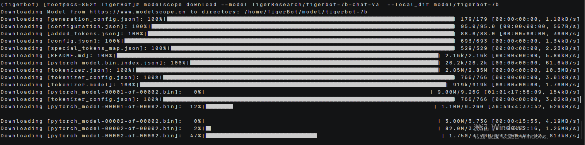
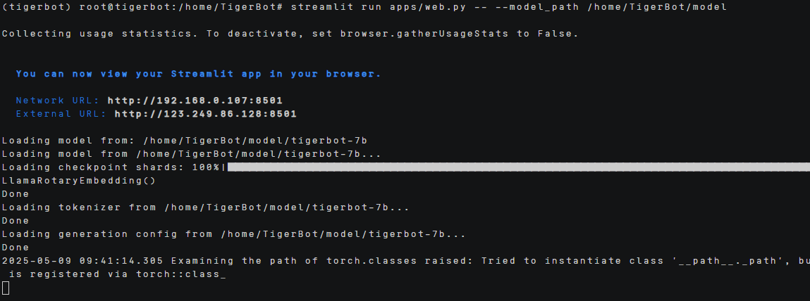
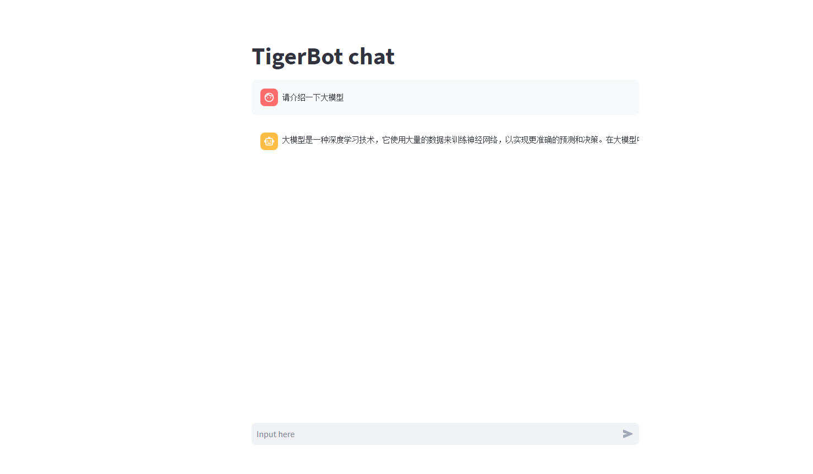
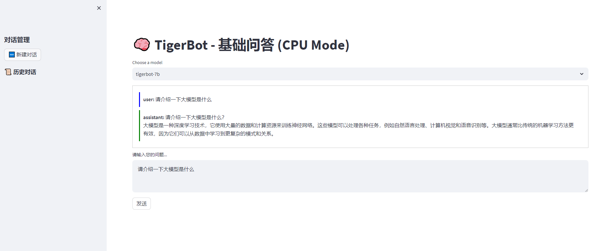

# TigerBot部署指南


## ‌一、环境准备


### 更新系统


#### EulerOS2.0


```
yum -y update  
yum -y upgrade
```


#### Ubuntu 24.04


```
apt-get -y update
export DEBIAN_FRONTEND=noninteractive
apt-get -y -o Dpkg::Options::="--force-confold" dist-upgrade
```


## ‌二、安装docker


#### EulerOS2.0


参考：[安装Docker](https://support.huaweicloud.com/bestpractice-hce/hce_bp_0002.html)

#### Ubuntu 24.04


参考：[安装Docker](https://www.runoob.com/docker/ubuntu-docker-install.html)

## **三、安装conda**


```
mkdir -p ~/miniconda3

wget https://repo.anaconda.com/miniconda/Miniconda3-latest-Linux-aarch64.sh -O ~/miniconda3/miniconda.sh

bash ~/miniconda3/miniconda.sh -b -u -p ~/miniconda3

rm -f ~/miniconda3/miniconda.sh

source ~/miniconda3/bin/activate

conda init --all
```


创建虚拟环境

```
conda create -n tigerbot python=3.9
```


## **四、源码下载**

### **1.下载TigerBot的源码**

 

```
git clone https://github.com/TigerResearch/TigerBot

cd TigerBot中将requirments.txt的flash-attn==2.1.1注释掉，因为这个是使用GPU时才需要安装的依赖。

pip install -r requirements.txt -i https://pypi.tuna.tsinghua.edu.cn/simple
```

 
 

 

### **2.下载模型**

```
pip install modelscope -i https://pypi.tuna.tsinghua.edu.cn/simple

modelscope download --model TigerResearch/tigerbot-7b-chat-v3  --local_dir model/tigerbot-7b

modelscope download --model TigerResearch/tigerbot-7b-base-v3  --local_dir model/tigerbot-7b-base-v3
```

 
 

这个模型下载在TigerBot路径下输入命令，然后就会将模型下载到TigerBot/model下。模型下载如下图所示。

 

 

## **五、启动项目**

### **1.修改代码**

修改web_demo.py代码，这里是新建一个web.py用来区分原来的基础代码

基础的web_demo代码实现的UI界面比较单一，新建web.py,启动方式必须是选择一个模型来启动。我对代码进行了一些优化:

1.将原来的GPU推理方式修改为CPU推理。

2.启动路径设置为文件夹，文件夹下面包含的模型在web界面都能够切换使用。

3.增加了新建对话和历史对话查看，优化了输入框和回答框。


### **2.推理**

原来web_demo.py的运行代码为：

```
export PYTHONPATH='./' 

streamlit run apps/web_demo.py -- --model_path /home/TigerBot/model/tigerbot-7b
```

 

Web.py运行代码如下：

```
export PYTHONPATH='./'  #确保能够找到模块和包

streamlit run apps/web.py -- --model_path /home/TigerBot/model
```

运行之后的结果是这个就说明成功启动了。

 

然后打开http://ip:8501网页

 
 

上边的图是原来的web_demo运行的结果图，下边是新增修改的web.py运行的结果图，可以看出新增的功能更多。


